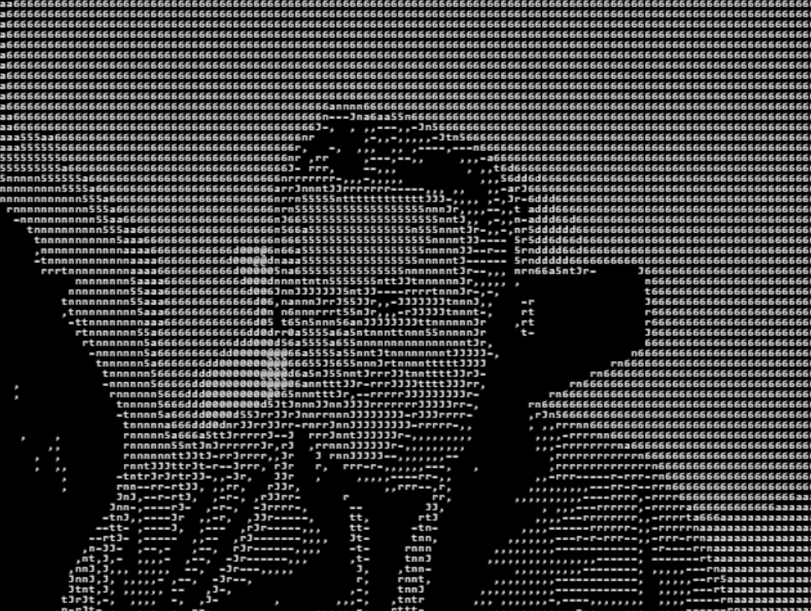
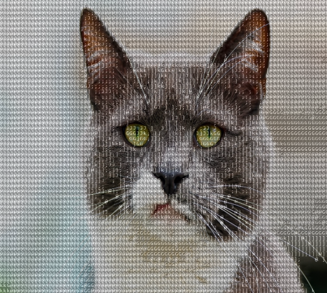

# ImageToAsciiart

Converts any picture or your live Webcam feed into ASCII art or any static image into ASCII.  Uses Javascript, P5.js and the Asciiart repository.

Code: Inside the code directory you will find 4 example scripts and Preview Html files. The advance files are more complex and feature rich (density, transitions and color).

